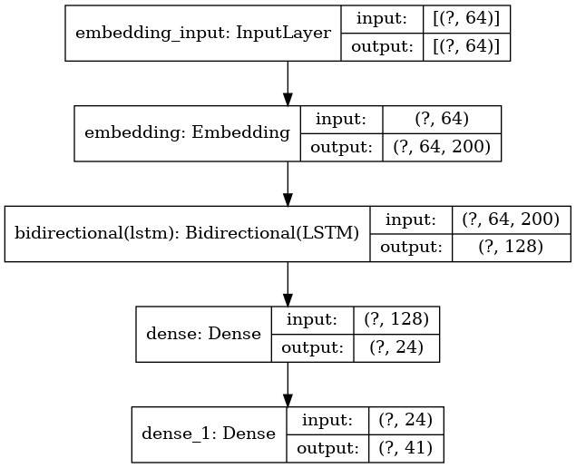
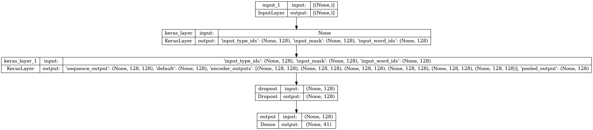
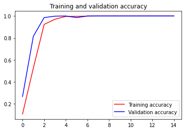
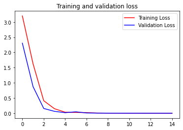
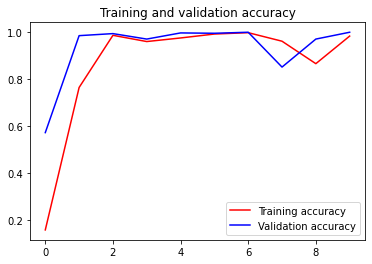
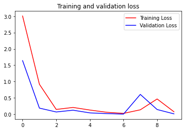

# get-he4lth
DTS Professional Academy 2022 ML with Tensorflow Healthcare 4

Dibuat oleh:
- Ilham Setiyo Kantomo - 152236035100-623
- Muhammad Adisatriyo Pratama - 152236035101-907
- Muhammad Nur Wachid - 152236035100-374
- Ricky Hermanto - 152236035100-1056
- Rifki Firdaus - 152236035100-617

## About
Get-He4lth merupakan sistem machine learning yang mampu memprediksi kemungkinan penyakit yang dialami pasien dengan memberikan keluhan yang dialami oleh pasien. Nantinya dari beberapa keluhan yang dialami oleh pasien akan diprediksi kemungkinan penyakit yang diderita serta ditampilkan juga deskripsi dan rekomendasi pengobatan dari penyakit tersebut.

## Dataset
Kami menggunakan dataset yang menurut kami cocok untuk dapat mengatasi hal seperti ini. Dataset terdiri dari 4920 kasus yang menyertakan gejala yang dialami dan menghasilkan 41 penyakit yang unik. Dataset juga terdapat beberapa data tambahan serperti deskripsi serta rekomendasi tindakan pencegahan dari setiap penyakit.

Dari dataset yang tersedia, kita mengambil dan menjadikan suatu feature untuk gejala dalam bentuk text berupa string untuk setiap baris pada dataset. Nantinya, setiap baris akan memiliki teks berupa string yang sesuai dengan penyakit yang kita definisikan sebagai label. Data yang kita gunakan untuk training adalah colom text yang berisikan gejala berupa string serta penyakit yang sesuai.

Data yang digunakan untuk proses training tersebut akan di split menjadi subset tertentu yakni train subset, validation subset, and test subset. Proporsi yang digunakan ialah sebesar 70% untuk training dataset, dan 30% untuk test subset. Dari 70% training dataset dibagi kembali menjadi 80% untuk train subset dan 20% untuk validation subset. Sehingga bisa dikatakan dari 100% dataset yang tersedia, 56% untuk train subset, 14% untuk validation subset, dan 30% untuk test subset.

Link to the dataset = [link](https://www.kaggle.com/datasets/itachi9604/disease-symptom-description-dataset?select=dataset.csv)

## Model

Kami menggunakan 3 model arsitektur yang berbeda untuk melakukan prediksi penyakit ini. Berikut adalah penjelasan secara detail tentang ketiga model tersebut.

### 1. Basic TensorFlow NLP Model

Merupakan TensorFlow Model Sequential API yang terdiri dari beberapa layer. Untuk menggunakan model ini dilakukan pre-processing seperti **tokenizer** pada text input dan **label encoder** pada label. Setelah dilakukan pre-processing terhadap data text input dan label maka data tersebut siap digunakan untuk training model.

Arsitektur Model Tensorflow Terbaik

### 2. Smaller BERT model dan preprocessingnya via TF-Hub [link](https://tfhub.dev/tensorflow/small_bert/bert_en_uncased_L-6_H-128_A-2/2)
Melakukan transfer learning model smaller BERT via Tensorflow Hub karena BERT adalah SOTA untuk masalah NLP, dengan mencoba BERT kita bisa mengetahui bagaimana performa dari model BERT itu sendiri. Untuk menggunakan bert kita juga perlu menggunakan layer pre-processing yang juga sudah tersedia via TF-Hub. Jika semua sudah disiapkan, model sudah siap di train dengan text input serta labelnya.

Arsitektur Model Bert

### 3. FastText Library Model (Non-TensorFlow)
Merupakan library yang terkenal karena performa kecepatan ketika training serta predicting dalam hal NLP terutama text classification. Hal ini dilakukan hanya untuk pembanding dengan model yang kita buat dengan TensorFlow.

## Result

Berikut adalah hasil performa dan metrik dari ketiga model arsitektur yang sudah dijelaskan diatas.

### 1. Basic TensorFlow NLP Model
Accuracy: 100 %
Validation Accuracy: 100 %
Loss: 0.0012
Validation Loss: 0.0011
Inference Time (s): 0.0579 s

Plot Loss dan Accuracy

### 2. Smaller BERT model dan preprocessingnya via TF-Hub [link](https://tfhub.dev/tensorflow/small_bert/bert_en_uncased_L-6_H-128_A-2/2)
Accuracy: 98 %
Validation Accuracy: 100 %
Loss: 0.0747
Validation Loss: 0.0112
Inference Time (s): 1.2850 s

Plot Loss dan Accuracy

### 3. FastText Library Model (Non-TensorFlow)
Accuracy: 99.11 %
Precision: 99.18 % 
Recall: 99.11 %
F1: 99.11 %
Inference Time (s): 0 s

## Summary

## Reference
